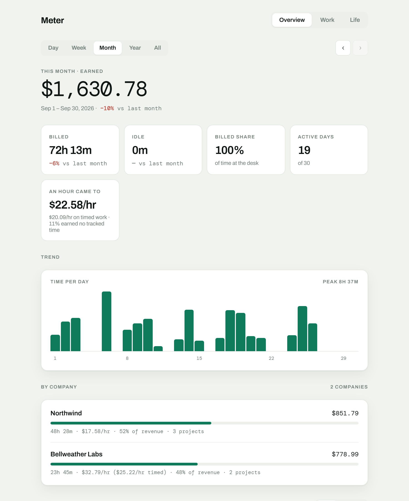
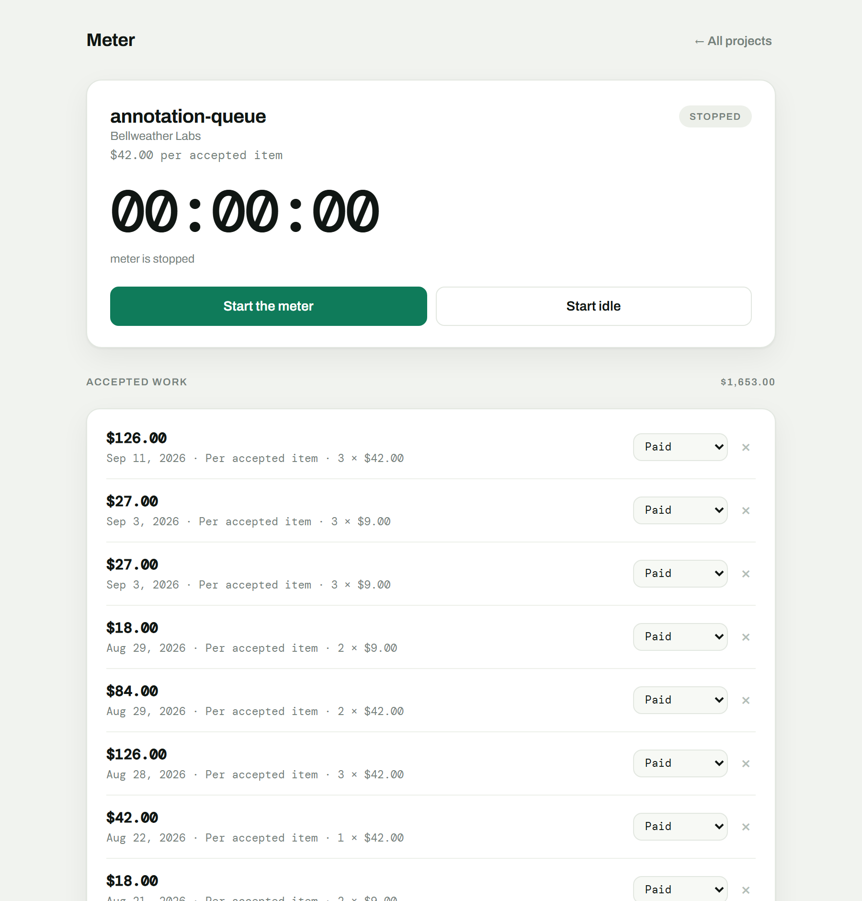
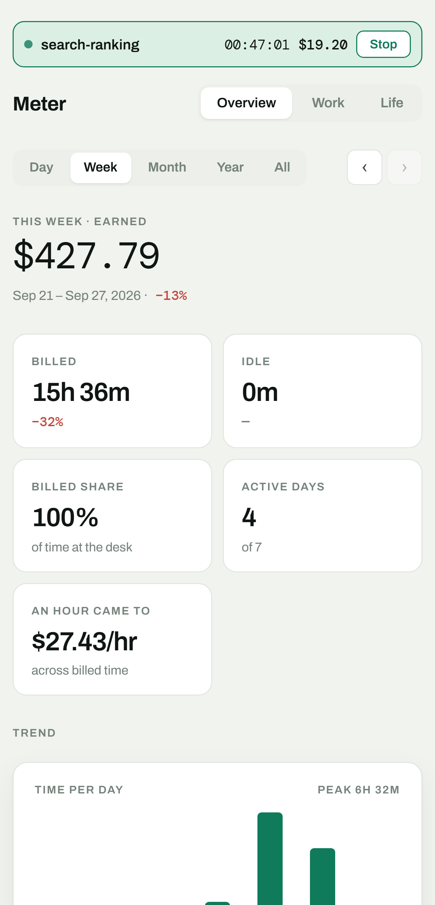

# Meter

**An hourly earnings meter.** Start a timer against a project, watch the money
accrue in real time, and keep an honest ledger of every session.

[](https://github.com/Ahmed41022/meter/actions/workflows/ci.yml)
[](https://github.com/Ahmed41022/meter/actions/workflows/pages.yml)
[](LICENSE)

### [→ Try it in your browser](https://ahmed41022.github.io/meter/)

Nothing to install, no account, no server. Your data stays in your browser
unless you switch on sync — and sync goes to a hidden folder in *your* Google
Drive, not to anyone else's machine.

<!-- SCREENSHOTS: drop the four PNGs into docs/images/ and delete these comment
     markers. See docs/images/README.md for exactly what to capture.

| Overview | A session running |
| --- | --- |
|  |  |

| A project | On a phone |
| --- | --- |
|  |  |
-->

---

## What it does

- **Times a session against a project** and shows the money as it accrues.
- **Snapshots the rate onto the session**, so changing a project's rate can
  never reach back into work you already recorded.
- **Reports any day, week, month, year or all of it** across every project at
  once — hours, earnings, what an hour actually came to, and how much of your
  income comes from one client.
- **Records money the clock never measured** — bonuses, per-item piece rates,
  rewards — so the ledger matches what you were actually paid.
- **Tracks pending, paid and cancelled**, because work finished is not money
  received.
- **Runs on a phone** as an installed app, offline, and syncs through your own
  Google Drive.
- **Exports** a JSON backup or a CSV of every line item.

The full tour, with examples of every panel, is in **[FEATURES.md](FEATURES.md)**.

---

## How it's built

Three decisions do most of the work, and each one exists to prevent a specific
wrong number:

- **Elapsed time is derived, never accumulated.** A session stores `startedAt`
  and computes `now - startedAt` on read. Browsers throttle background tabs to
  about one tick a minute and a sleeping machine stops ticking entirely — so a
  counter would quietly lose most of every session.
- **Money is derived from time, never stored.** No total is ever cached,
  because deleting a session would immediately make a cached total lie.
- **Time is an argument, never ambient.** No function in `src/domain` calls
  `Date.now()`; the caller passes `now`. That single constraint is what makes
  the whole rules layer testable without mocking a clock.

The reasoning behind every other decision — soft deletes, segments rather than
start/end pairs, crash recovery, idle time, task rate overrides, schema
evolution without version numbers — is in **[ARCHITECTURE.md](ARCHITECTURE.md)**.

**Stack:** React 18, esbuild, Vitest. Two runtime dependencies. No framework,
no state library, no CSS framework.

---

## Tested

Every rule in the domain layer is tested without a browser, and the
integration tests drive the *built* file in jsdom rather than the source, so
what ships is what was tested.

Coverage floors are enforced in CI — 85% lines, functions and statements, 80%
branches — over `src/domain` and `src/storage`. The suite runs on both Linux
and Windows, because it has twice been green on one and red on the other.

```bash
npm run check      # lint, build, then test
npm run coverage   # with the thresholds enforced
```

More on what is and isn't tested, and why: [ARCHITECTURE.md](ARCHITECTURE.md#testing).

---

## Getting started

```bash
npm install
npm run build      # produces dist/meter.html
npm test
```

| Script | What it does |
| --- | --- |
| `npm run build` | Bundle into a single `dist/meter.html` |
| `npm test` | Run all tests |
| `npm run coverage` | Tests with coverage thresholds enforced |
| `npm run lint` | ESLint |
| `npm run check` | Lint, test, and build — what CI runs |
| `npm run icons` | Regenerate the icon set from `scripts/make-icons.py` |
| `npm run desktop` | Package a standalone Windows `.exe` |

`npm run build` must run before `npm test`, because the integration suite drives the built file rather than the source.

---

---

## Running it

**Just open it.** `dist/meter.html` works by double-clicking. Everything is inlined — React, styles, icons.

**As a desktop app.** Run `tools/Setup Meter.bat` from a folder containing `meter.html` and `meter.ico`. It creates a Desktop shortcut that launches Edge or Chrome in `--app` mode with its own `--user-data-dir`, so you get a separate process, its own taskbar entry, and no browser chrome.

**As a real executable.** `npm run desktop` packages a standalone `Meter.exe` — its own process, its own taskbar entry, no browser involved. The shell in `desktop/` is more than a wrapper:

- it remembers window size and position between launches
- a second launch focuses the existing window instead of starting a rival process that would fight over the same storage
- closing with a meter still running asks first, since that is exactly how a session ends up billing overnight

That guard reads persisted state directly, because the Electron main process can't import the app's ES modules. The duplicated rule lives in `desktop/running.js` with its own tests — nothing else would notice if it drifted from the domain. Any doubt (corrupt storage, a failed read) resolves to "not running", so a broken guard can never trap you inside the app.

The cost is real: about 220 MB on disk to run a 300 KB file, because it ships its own copy of Chromium. That copy also stops receiving security patches when the pinned Electron does. The shortcut above gets you the same standalone window using the engine Windows already keeps updated, which is why it's listed first.

Note that Edge and Chrome grey out "Install as an app" for `file://` pages, since installation requires a secure origin. That's why the shortcut route exists.

---

---

## Versioning

Meter follows semantic versioning, with the version tied to the one
compatibility boundary that actually matters here — **the stored ledger**:

| Bump | Means |
| --- | --- |
| **Major** | The stored shape changed such that an older build can no longer read it. |
| **Minor** | A feature. New fields land here safely, because an absent field always has a defined meaning. |
| **Patch** | A fix that stores nothing new. |

Releases are tagged `vX.Y.Z` and carry a built `meter.html` and a packaged
Windows desktop app. See [CHANGELOG.md](CHANGELOG.md).

---

## Known gaps

- **Corrections replace, they don't accumulate.** `original` holds what the meter recorded, and that's it — there's no log of each successive edit or when. Enough to prove a figure was adjusted; not a full audit trail.
- **No re-filing or repricing history.** A session doesn't record that it was moved between tasks, and a task doesn't record that its rate changed or when.
- **No archiving.** A task you've finished with stays in the start prompt's dropdown forever. Delete is the only way out, and that unfiles its sessions.
- **No cross-project task view.** Tasks belong to one project, so a task number spanning two projects reports as two separate tasks.
- **No billing increments.** Time is billed to the second. If you invoice in 15-minute blocks, the ledger and your invoice will disagree.
- **No cross-tab locking.** Two tabs are detected and warned about, but not prevented.
- **Idle time isn't in goals.** Deliberate — a money goal fed by unbilled time is meaningless. If it belongs in goals later, the right shape is a utilisation target, not a second money target.
- **Fonts load from Google Fonts.** First run with no internet falls back to system faces. Layout is unaffected.

---

## License

MIT — see [LICENSE](LICENSE).
